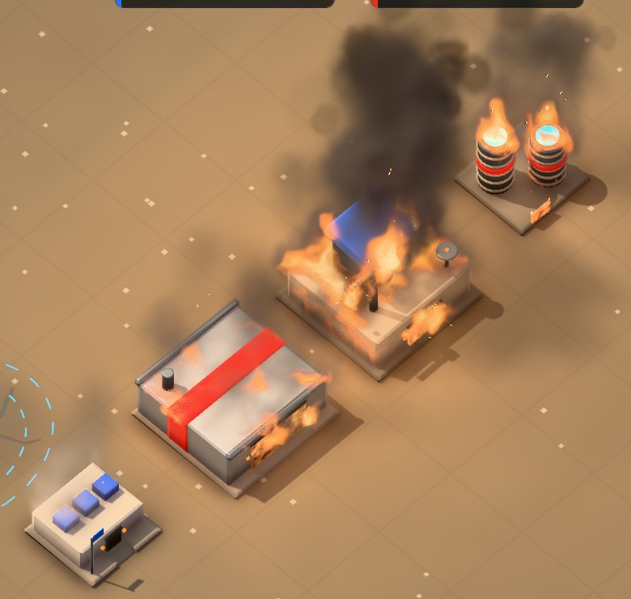
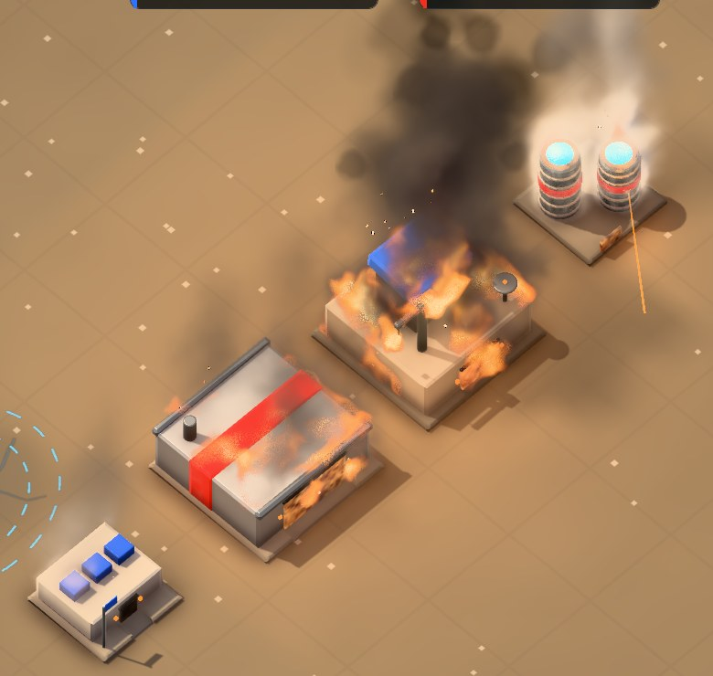
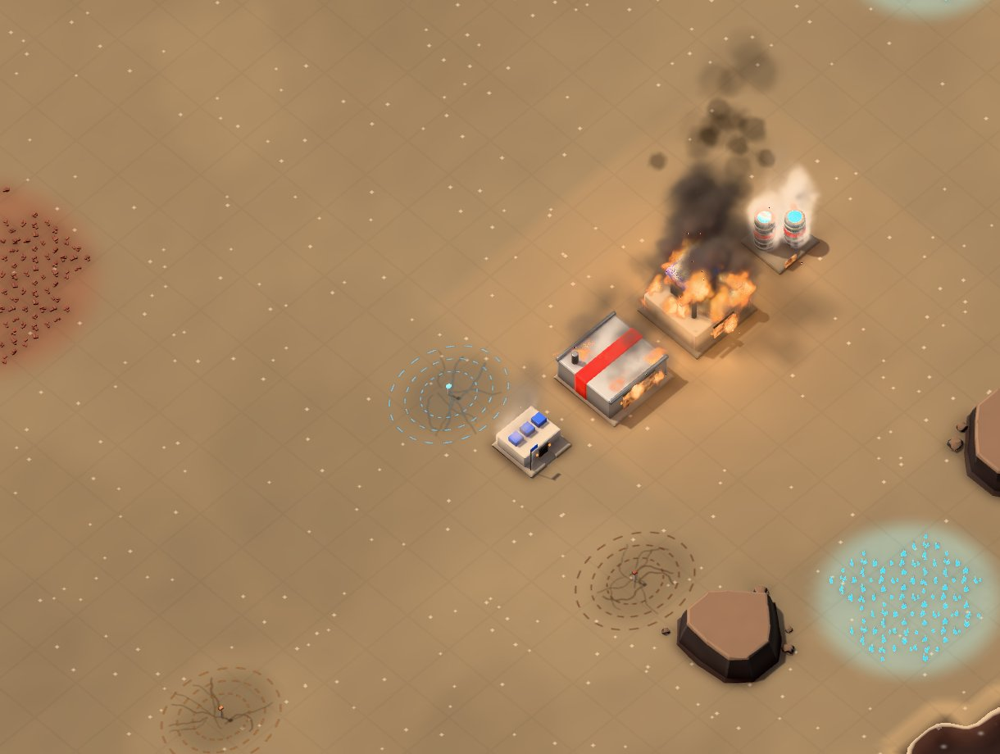
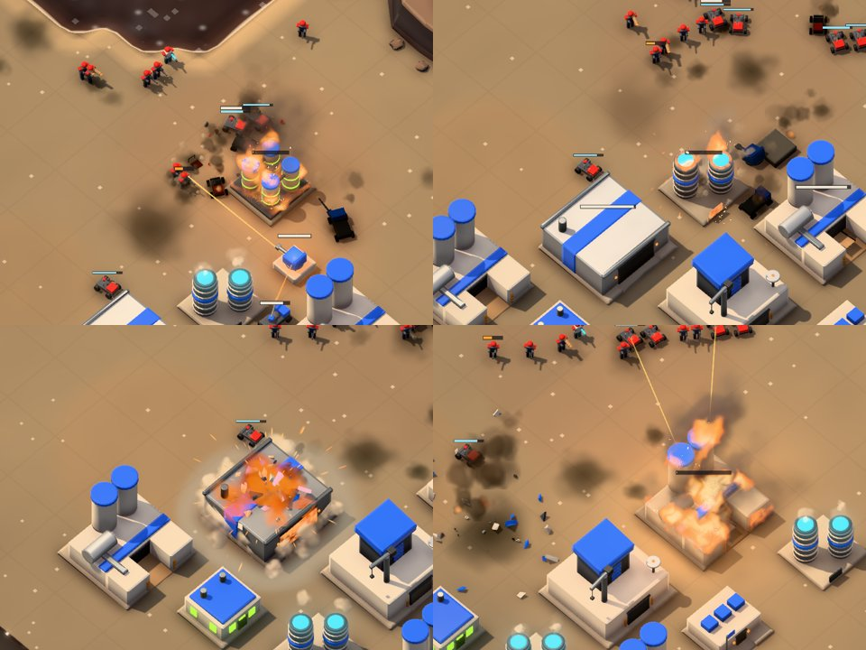
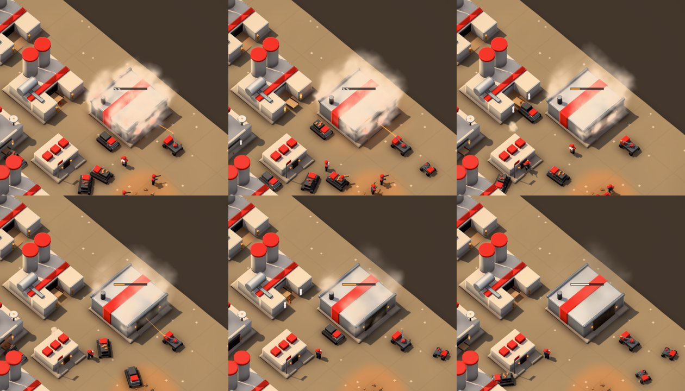
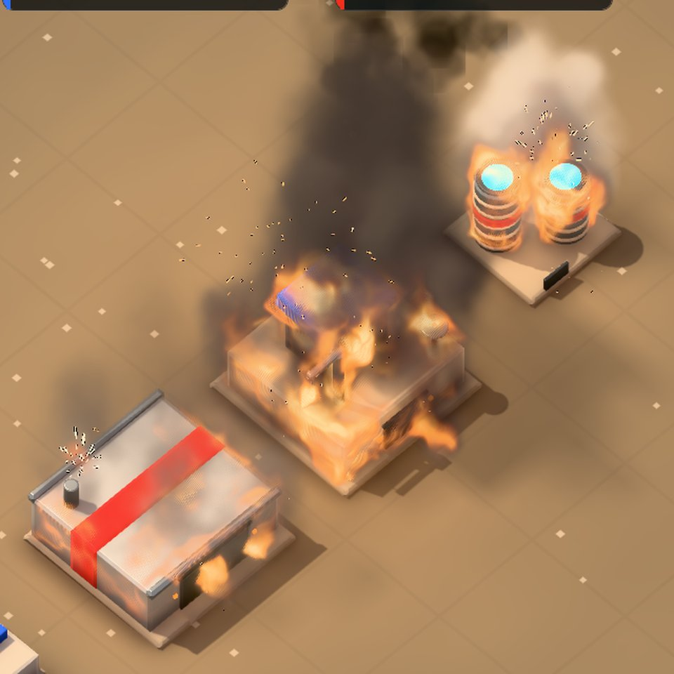

# Building fire: a fluid simulation per burning building

**Scope:** view only (`unity/Assets/Pez/View`, shaders). The sim, the API and the save format are unchanged. Fire still comes from a building's health and repair events, exactly as before.

**Source:** Unity's breakdown of Ignitement's fire, [Real-time fluid simulation: fire VFX](https://unity.com/blog/real-time-fluid-simulation-fire-vfx-ignitement-breakdown).

The particle fire (`BuildingFire`) is replaced by a GPU fluid simulation shaped to each burning building. `BuildingFire` remains as the fallback on machines without compute shaders, and for burning buildings beyond the budget of eight fluid fires.

## Captures

| Uncontrolled: black smoke, the plant's towers wrapped in flame | Fought: a repair beam on the plant turns its fire to white steam |
|---|---|
|  |  |

These are the `-fxdemo fires` bench, left to right: a barracks smouldering, a factory burning, a command center raging, and a power plant raging.

- **Gameplay distance:** 
- **A live AI game:** attacked buildings burning through the normal damage path. 
- **A live repair:** an AI repair truck fights a factory at 14% health. It turns to a white billow, then grey smoulder wisps as its health climbs, then clean. Frames are 3 to 15 s apart. 
- **The first working build, for comparison:** washed-out flames and no char. 

## What the brief asked for, and how it's met

| Ask | How |
|---|---|
| Emanates from buildings | Fuel comes off the building's own skin: the cells just outside its voxelized meshes (roofs fully, walls weakly, nothing under overhangs). As damage grows it catches in noise patches, so a fire spreads across the roof instead of switching on. |
| Licks out of windows | The art has no literal windows, so dark recesses, doors, vents and frosted glass act as openings (`FireVoxels.IsOpening`). Flame jets out of the head of each opening along the wall's normal, and buoyancy curls it up the facade above. The opening itself glows with moving hot spots of the fire inside (`_PezBurn`). |
| Follows the shape | The model is voxelized into a signed distance field. Solid cells are walls in the pressure solve, so the flow goes round the real silhouette: flames wrap the power plant's towers, climb the command center's sides and pour over roof edges. |
| Integrated into the scene | The fire lights the scene through a world-space light map that the model and ground shaders sample once each (Ignitement's trick, below), and its smoke shadows the ground. The raymarch stops at the scene's depth and at the building itself, so units and walls in front stay in front. The building chars as it burns and recovers as it's repaired. |
| Throws sparks from time to time | GPU embers stream off the fire, carried by the simulated flow. Every few seconds a pocket of gas pops: a flare-up impulse in the simulation and a burst of sparks thrown in two waves, a spray rather than a starburst. |
| Black smoke when uncontrolled | Combustion yields soot in proportion to the fire's size. Soot absorbs light (near-black albedo) and leans downwind in a column. Past the top of the grid the column carries on as particle smoke. |
| White smoke when fought by repair | A repair beam on the building drives an extinguish field around the point it hits. Flame and heat there are knocked down and converted to steam, which scatters light (cream white). Soot production stops, and the steam fades fast once the repair stops. A burning power plant's towers stop their usual steam, so white means "being fought". |

## From Ignitement's 2D field to a 3D grid per building

Ignitement simulates one 2D field that follows the camera, because their fire spreads over the floor. A building's fire is vertical: it climbs walls and leaves through openings. So each burning building gets its own small 3D grid around it instead:

- **Cells:** at most 120,000 (about 9 MB of GPU state).
- **Domain:** the building's bounds, plus room for flames to lean and lick out, plus about 2 to 3.5 tiles of plume above.
- **Cell size:** 0.075 tiles or coarser for bigger buildings, rounded to whole thread groups.

Kept from the breakdown:

- **The step order:** advection, an extinguishment impulse, vorticity confinement, then divergence, pressure and projection.
- **Hardware trilinear filtering for advection.** Theirs is in fragment shaders; ours is in compute, where `SampleLevel` on a 3D texture gives the same thing.
- **Detail the simulation doesn't pay for.** Their parallax trick plays this part. Ours bends each raymarch lookup by a scrolling noise.
- **The light map** sampled at `worldPos + worldNormal * c`.
- **Particles that sample the velocity field.**
- **An AsyncGPUReadback** of a small summary. Theirs feeds gameplay; ours feeds the particle plume above the grid.

## Pieces

| File | Role |
|---|---|
| `View/FireVoxels.cs` | Builds the grid from the finished model. Reads the meshes in world space on the main thread, then on a worker thread: a column-parity voxelizer, a 3D chamfer signed distance, skin emitters with patch noise, and opening sites (farthest-point picks among the sideways faces of opening parts, else spots on the walls). |
| `Resources/PezShaders/PezFireSim.compute` | The simulation (below), plus the light map (`Reduce`, `Splat`, `ClearMap`), the plume summary (`Outflow`) and the sparks (`SparkSpawn`, `SparkStep`). |
| `View/FireSim.cs` | One fire's GPU state and frame. Owns the eight-fire budget, the light map compose (`LateUpdate`), the per-view light masking for fog, and `FireShade` (char and glowing openings). |
| `Resources/PezShaders/PezFireVolume.shader` | Raymarches a box around the building, front to back. |
| `Resources/PezShaders/PezFireSpark.shader` | Embers and sparks: six vertices per particle from a StructuredBuffer, stretched along their screen motion, HDR so they bloom. |
| `Resources/PezShaders/PezFire.cginc` | The light map lookup, included by `Pez/Model` and `Pez/Ground`. |
| `View/FxSystems.cs`, `View/Fx.cs` | The `Plume` particle system: cool, buoyant smoke continuing the column above the grid. |
| `View/WorldView.cs` | `Damage()` drives the fire from health. The `repair` event marks the building as being fought (`RepairAt`, `RepairPoint`). `SetPov` masks the fire for fogged views. |
| `View/FxDemo.cs` | `-fxdemo fires`: a barracks smouldering, a factory burning, a command center raging, and a power plant raging that a repair beam fights every other 8 s. |

### The simulation step

The simulation steps at a fixed 30 Hz, with neighbouring fires on alternate frames. Each step is about 21 dispatches.

1. **Advect**, one pass. It back-traces velocity and scalars, then in the same pass applies:
   - the sources: skin patches, openings, smoulder, and pops;
   - combustion: burning gas lasts 0.3 to 0.55 s and releases heat and soot;
   - extinguishing: heat and flame turned into steam;
   - cooling and dissipation, faded toward the open sides and top so the domain has no edge;
   - buoyancy, and the prevailing wind (`FxSystems.Wind`), stronger above the roofs;
   - a fine flicker force where the gas is hot;
   - the outward jets at openings.
2. **Curl and Confine:** vorticity confinement, stronger where the gas is hot.
3. **Divergence, 14 Jacobi iterations, Project:**
   - Pressure is warm-started from the last step.
   - The building and the ground are walls.
   - The open sides and top have zero pressure.

The fields are half-float 3D textures:

- velocity;
- scalars: temperature, soot, steam and pale smoke, and reaction (burning gas);
- pressure, divergence and curl;
- a static signed distance;
- a static emitter texture.

### Rendering

Up to 80 steps per pixel, with a static per-pixel dither. A dither that moved each frame would cost the JPEG streams bandwidth.

- **Flame:** emission coloured by temperature, through a stylised blackbody (deep red, orange, yellow-white core), with a defined edge on the reaction field.
- **Soot:** absorbs, with a near-black albedo.
- **Steam:** scatters, with a cream albedo.
- **Smoke lighting:** the sun through one shadow tap toward the light, the sky (SH), and the fire's glow from below, weighted by the smoke's albedo.

### The light map

- **Coverage:** one RGBAHalf texture over the whole map at half-tile texels.
  - rgb is the fires' light.
  - a is the shadow of their smoke on the ground.
- **Building it:** each fire gathers its glow into 48 block lights (`Reduce`). Then it splats them, with distance falloff, and marches a sun ray through its soot (`Splat`), but only within its own rectangle. Ping-pong copying keeps overlapping rectangles correct.
- **Using it:**
  - `Pez/Model` adds `albedo * light * 0.6` and darkens by the smoke shadow.
  - `Pez/Ground` adds `albedo * light`.
- **Fog:** a view that can't see a fire gets that fire's rectangle masked out (`_PezFireRects`, `_PezFireVis`, set in `WorldView.SetPov`). The volume, the sparks and the plume are drawn only on the layers of the cameras that see the building. Its char and glowing openings are reset for those views' renders.

## Cost

These were measured with `-perfprobe` on the `-fxdemo fires` bench: four fluid fires, at 1600×1000 on this Mac (Apple silicon), uncapped. Every run was checked with a screenshot to confirm the fires were burning.

| | avg ms | p50 ms | p95 ms |
|---|---|---|---|
| No fires (`-firedebug nosim,novol,nolight,nosparks,noplume`) | 2.7 | 2.4 | 5.5 |
| First working version (simulation every frame, 18 Jacobi, hashed noise per raymarch step) | 9.0 | 3.7 | 27 |
| Shipped (30 Hz staggered, 14 Jacobi, baked noise texture) | 4.3 | 3.2 | 8.2 |

That's about 0.4 ms per burning building. Voxelizing a building takes tens of milliseconds, and it runs on a worker thread, so a building catching fire doesn't hitch the frame. `-firedebug` (`novol`, `nosim`, `nolight`, `nosparks`, `noread`, `noplume`) switches parts off for profiling.

## Tunables

- `PezFireVolume.shader` properties:
  - `_FlameGain`: flame brightness;
  - `_SootK`: soot density;
  - `_SteamK`: steam density;
  - `_Detail`: the warp, in cells.
- `PezFireSim.compute` `Advect`:
  - source rates;
  - burn lifetime;
  - soot yield;
  - extinguish strength;
  - dissipation;
  - jet strength.
- `FireSim.Common`:
  - `_Buoy` and `_Vort`;
  - how damage maps to coverage.
- `FireSim.SparksAndPops`: the ember rate, and the pop interval and size.
- `FireSim.MaxLive` and `FireVoxels.MaxCells`: the budget.
