# Rendering quality pass

**Branch:** `render/quality-pass`. **Scope:** view only (`unity/Assets/Pez/View`, shaders, one player setting). The sim, the API and the save format are unchanged, and the headless tests pass.

The goal was a look closer to what Unreal gives out of the box: grounded lighting, contact shadows and AO, a filmic grade, glowing emissives and richer effects. It stays on Unity's built-in render pipeline and keeps the game readable from high up and through a compressed MJPEG stream.

## Before and after

All pairs use the same saved game (`-snapshot` of a 4-AI game at 21:26, resumed paused), the same camera pose and the same window size (1728×1080). The battle shots run `-fxdemo storm` over the Blueberry base, so the explosions match in kind but not frame for frame.

| Shot | Before | After |
|---|---|---|
| Wide base view | 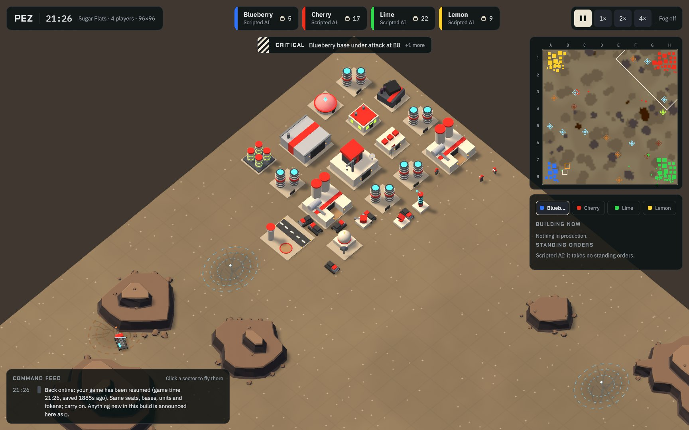 | 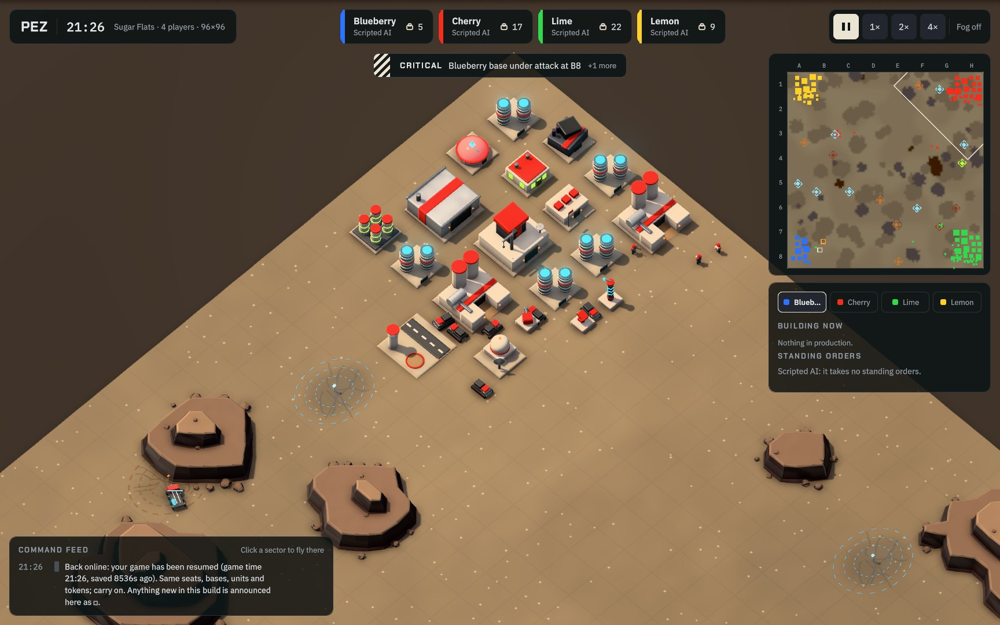 |
| Close zoom on a base | 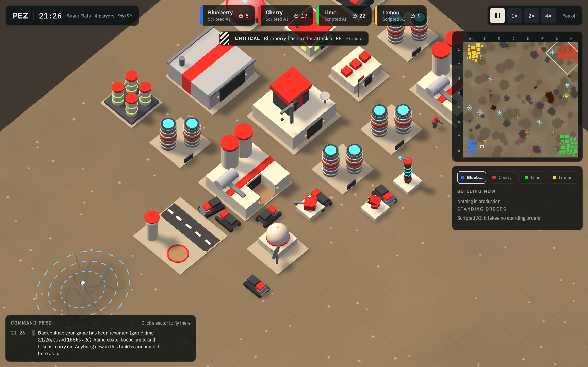 | 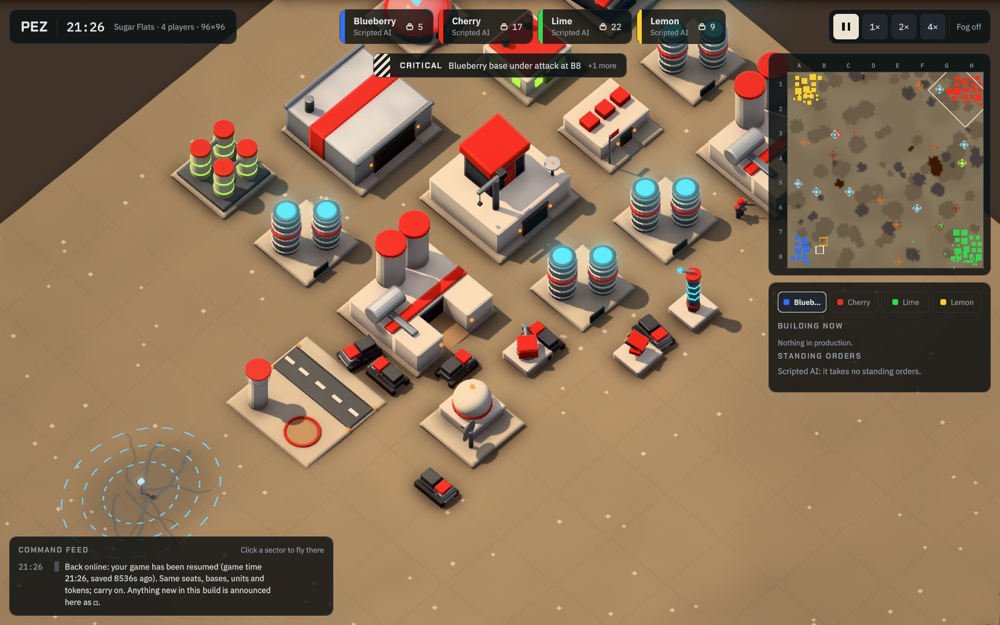 |
| Bevels and foundations (2× crops: factory, command center, refinery dock) | 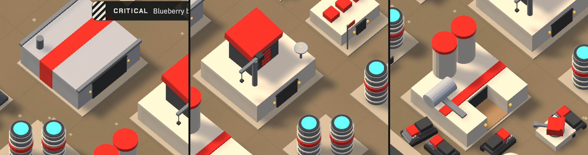 | 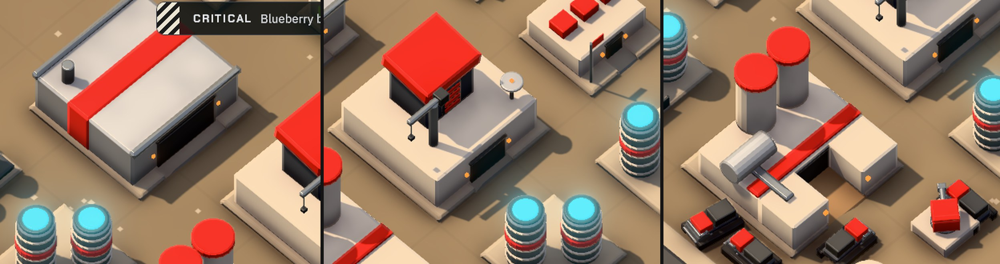 |
| Battle with explosions | 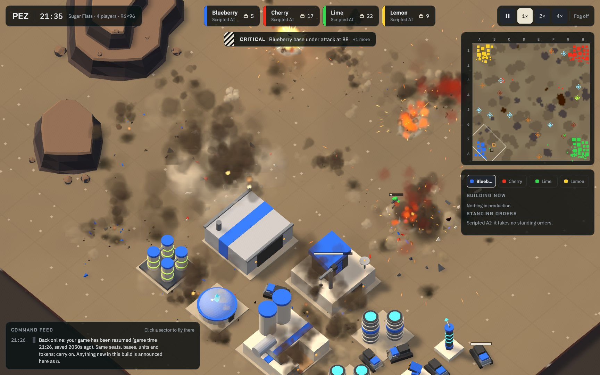 | 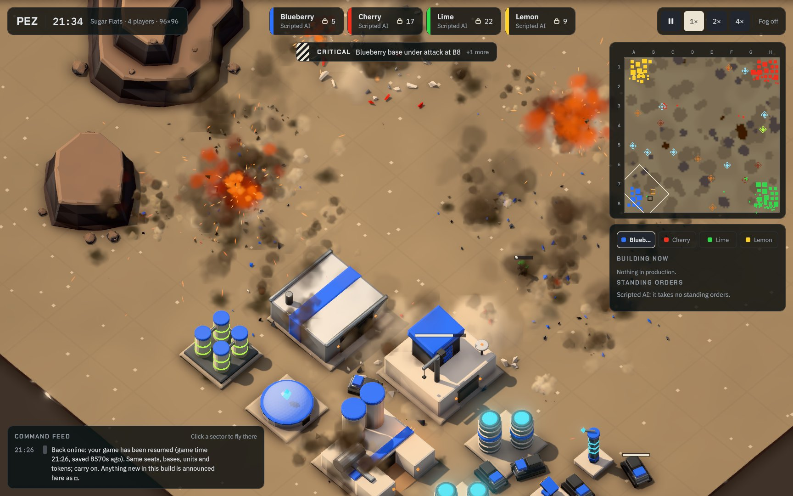 |
| Water and terrain | 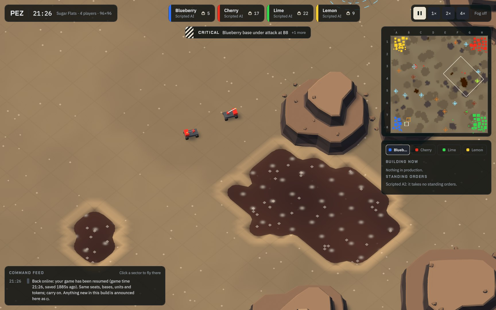 | 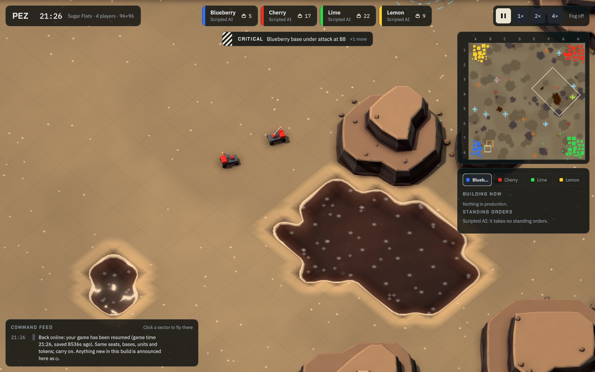 |
| Whole map | 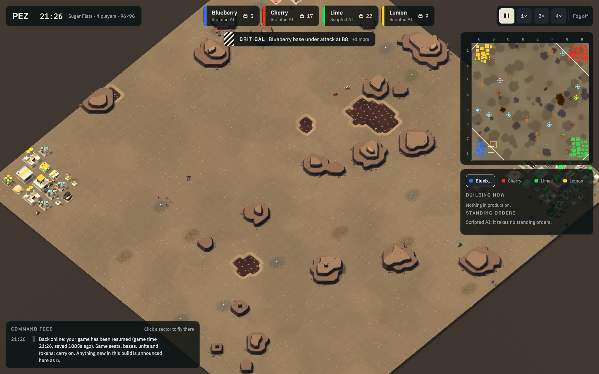 | 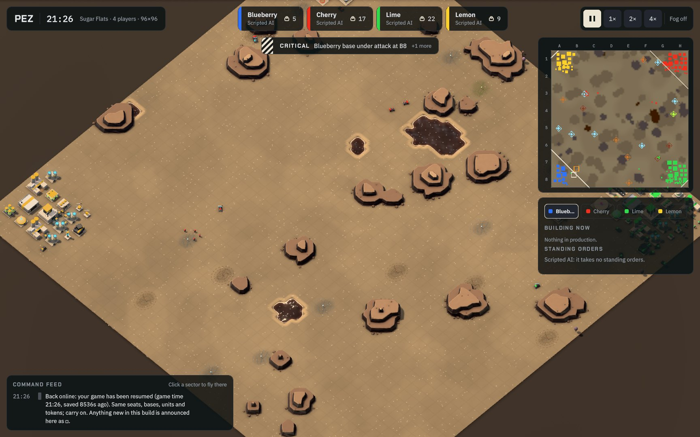 |
| Player stream frame (exactly as the MJPEG stream sent it, Cherry at its base) | 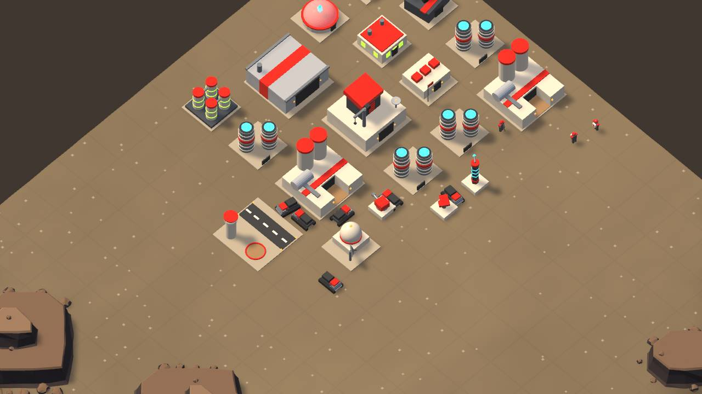 | 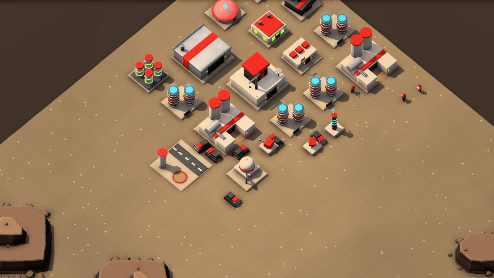 |
| Player stream in a battle (Blueberry, under its fog) | 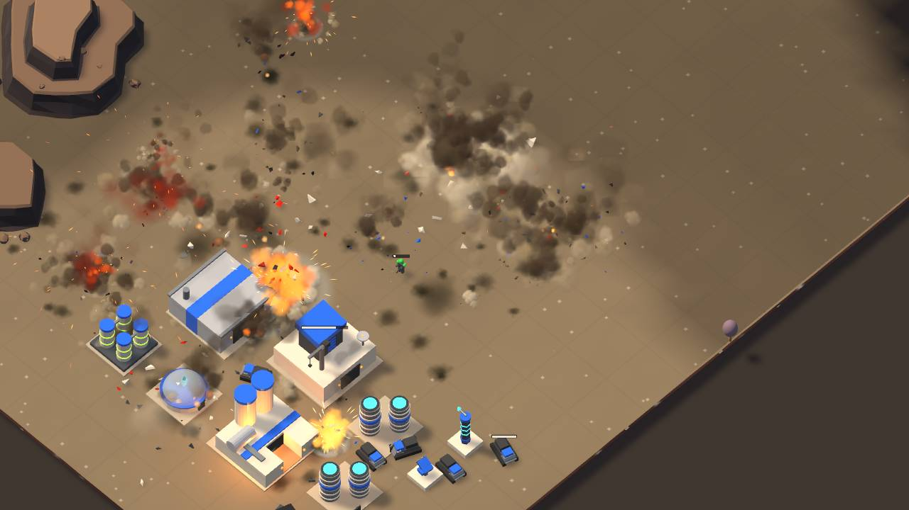 | 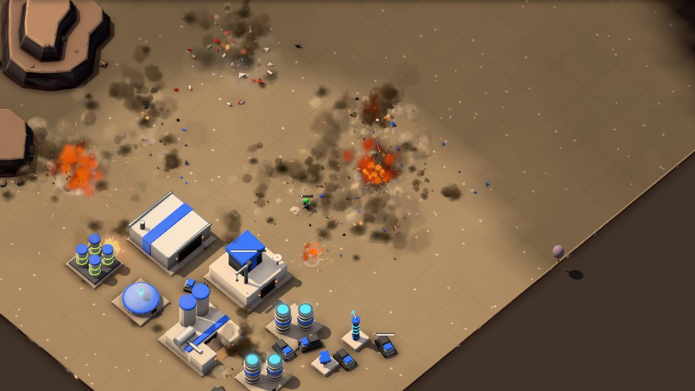 |

## What changed

### Post-processing (`PezPost.cs`, `Resources/PezShaders/PezPost.shader`)

This is a lean custom stack on the main camera and the player-stream camera. It doesn't use the Post Processing Stack v2 package: the custom stack has no package dependency, and every pass is known to work in a batchmode player build.

- **Ambient occlusion for the orthographic camera.** View-space positions are rebuilt from the linear ortho depth, with Alchemy-style obscurance from a golden-angle spiral of samples. It runs at half resolution with a depth-aware blur. The radius is 0.55 tiles and never drops under 2.5 px.
  - Depth lookups snap to texel centres with a quarter-texel bias. Without it, half-resolution pixel centres land exactly on depth texel boundaries and flat ground breaks into bands.
  - The near and far clips are now fitted to the view (`RtsCamera.FarClip`), which keeps the linear ortho depth precise.
- **Bloom.** A threshold (2.0, soft knee) feeds a mip chain down and a tent filter back up. Only real HDR sources bloom: the `M_E_*` emissives (now ×2.6), lasers and tracers (HDR colours), muzzle flashes, sparks, fireball cores and the ore glow.
- **Tonemap.** Khronos PBR Neutral, which preserves hue, with two knobs changed for this game:
  - Highlight desaturation is 0.015, down from the reference's 0.15. At the reference value, sunlit team red turned pink.
  - The toe is gentler (0.012). The reference's 0.04 black offset turned the biscuit ground orange.
- **Grade.**
  - Exposure 1.06 and a slight contrast lift about mid grey.
  - Cool shadows and warm highlights, from the art pack's warm sun and cool sky.
  - A 12% vignette.
  - No grain or noise, so the JPEG streams stay small.
- **Health and fuel bars stay out of post.** They moved to their own layer (29), which no camera culls in. `PezPost` draws them in `CameraEvent.AfterImageEffects` with each camera's own view and projection matrices. They stay crisp and keep the HUD kit's exact colours, and fog-of-war hiding per stream still applies.
- **The HUD is untouched.** IMGUI draws after the cameras.
- **Not added:** no tilt-shift or depth of field. At ~40 px per tile it only blurs units.

### Lighting (`Look.cs`)

- **Sun:** warm #FFE4C0 at intensity 1.35, from the upper left as before.
- **Shadows:** Soft (PCF), strength 0.82, bias 0.02 and normal bias 0.3.
- **Ambient:** trilight from a cool sky, a neutral equator and a warm biscuit bounce.
- **Reflections:** a small procedural sky cubemap with mips (`Look.SkyCube`), close to neutral grey.
  - Before, the default reflection was black (there's no skybox), so metal and glossy plastic reflected nothing and read flat.
  - The cubemap is kept neutral because a blue sky turned the steel stacks teal.
- **Shadow fit for the orthographic camera.**
  - The camera now sits `orthoSize + 14` back instead of 150 (`RtsCamera.BackDistance`).
  - There is one cascade, close fit, with the shadow distance fitted to the visible slab (`ShadowReach`).
  - Before, four cascades were split over 260 units of depth, and everything visible fell into the last, coarsest cascade.
  - Shadows are now crisp at every zoom. The player streams refit for their own zoom before each render and restore the main view's values after.

### Materials (`Look.cs`, `Resources/PezShaders/PezModel.shader`)

Every opaque glTF material is converted to `Pez/Model`, which uses Unity's StandardSpecular lighting. Smoothness, metalness, a dielectric reflectance scale and the edge strength are set per material name:

| Material | Treatment |
|---|---|
| Team paint | Satin, with about a third of the usual 4% reflectance. Plain 4% adds white to every channel of a saturated colour. |
| Cream plastic | Semi-gloss. |
| Smoke plastic | Satin. |
| Spring steel (gunmetal) | Metallic 0.85. |
| Foil | Metallic. |
| Licorice | Satin black. |
| Sugar pad (concrete) | Rough. |
| Kraft | Rough. |
| Emissives | HDR ×2.6. |
| Ores, cliffs | Tuned per type. |

Names are kept, so `TintTeam` and `TintOre` still work. Glass keeps glTFast's shader, with more gloss. Each converted material also gets:

- low-frequency world-space grime: ±7% value and a little gloss variation;
- the pack's darker foot near the ground;
- **chamfered edges** (see below).

**Team colour check.** On the close-up, the Cherry command-center roof measured:

| | Saturation | Value |
|---|---|---|
| Before | 0.84 | 1.00 (the red channel clipped) |
| Mid-pass, the pair the owner flagged | 0.68 | 0.97 |
| Now | 0.85 | 0.97 |

In the player-stream frames, the most vivid 2% of pixels went from saturation 0.69 to 0.71 (Lime) and 0.79 to 0.81 (Cherry).

### Bevels: "take the sharp edges off the buildings" (`Models.BevelData`, `Pez/Model`)

Every art-pack mesh, plus the cliff massifs and boulders, gets a **shading chamfer**.

- **How it's stored.** When a mesh is unwelded for flat shading, each triangle corner records:
  - the exact distance to each of its edges;
  - each edge's chamfer normal (the average of the two face normals) in tangent space;
  - a bevel width of 3% of the connected part's size, clamped to 0.012–0.05 units.
- **What gets a bevel.** Coplanar seams (quad diagonals, material splits on one face) and concave creases get none. Open plate rims lean outward.
- **How it's shaded.** Within the width of a convex crease, the surface takes the chamfer's normal, and the boundary is anti-aliased. The edge catches the sun and the sky as a thin highlight line, like a real 45° chamfer, and the faces stay flat-shaded.
- **Why shading and not geometry:**
  - `art-src/tools/build_models.py` (the pack generator) is older than the shipped `.glb`s. It has no `deep_mine`, `drill_rig`, `geological_surveyor` or deposit marker, so regenerating would lose assets.
  - A geometric chamfer of glTFast's merged, overlapping meshes at runtime is fragile.
  - A shading chamfer leaves nodes, pivots, footprints, `M_Team` and every moving part exactly as they were.
  - At ~40 px per tile, a 0.04 geometric chamfer changes a silhouette by under 2 px.
- **Infantry.** The leg split (`Gait`) carries the data, so infantry get the bevel too.
- **The plinths' top edge is a real geometric chamfer**, since that mesh is built here.

### Foundations with driveway ramps (`Plinths.cs`)

- **The plinth.** Every multi-tile structure's flat 0.08 pad (`stage_0__M_SugarPad`) becomes a **0.12 concrete plinth with a chamfered top edge**.
  - It is the same footprint (pad size, so inside the pack's 0.04 margin) on the same node.
  - It still rises with `stage_0` during construction, and no second slab is stacked.
- **Ramps.** A **ramp** runs from the plinth's south edge up to each roll-up `door`, as wide as the door plus a margin. Doors face −Z, as `docs/art/ASSETS.md` says.
  - The factory, barracks and command center get one.
  - At the **refinery**, the kraft dock floor becomes the ramp surface, so trucks reverse up a kraft lane into the dock.
- **Structures left without a ramp:**
  - The airfield keeps its pad height, because its aircraft lift sits flush in it.
  - The 1×1 defenses already stand on their own base blocks.
  - The outpost's raised ore drop pad has no door node, so it gets no ramp.
- **Units on the plinth.** Ground units get a visual height from `Plinths.HeightAt`: the plinth top, or the ramp slope. New units roll down the ramp from the door, and docking trucks ride up it, instead of clipping through the slab. The sim stays 2D.

### Ground, water and cliffs

- **Ground (`PezGround` and `TerrainView`):**
  - A broad ±3.5% value and warmth variation, and shallow sun-lit dunes. The dune slope is baked into UV1 and shaded against the sun's direction, so it follows the camera's yaw.
  - Both stay inside the art pack's 8% quiet-ground budget and are baked per vertex, so they cost no per-pixel noise.
- **Ground chunks.** The ground is now **24-tile chunks** that each camera culls, and it no longer casts shadows.
  - An 8-player arena grows to 288 tiles a side, which was 1.5M triangles drawn three times per camera render, for the main view and every stream.
  - This is most of the frame-time headroom that pays for the post stack.
- **Water (`Shaders/Water.shader`):**
  - Per-pixel travelling ripples catch the sun and reflect the sky with PBR fresnel.
  - The water's thickness comes from the depth texture: the deep middle is darker, the seabed shows at the edge, and a pale fizz line breathes where the cola meets the shore.
  - The glints are smaller and sharper.
- **Cliffs.** The massifs use `Pez/Model` with crease bevels and grime.

### Effects (`Fx.cs`, `FxSystems.cs`)

- Every explosion and muzzle-flash light (`Lamp`) also throws an additive **light pool** on the ground. The light reads in every view and stream, even when the per-pixel light budget (4) is spent.
- Beams and tracers are HDR, so they glow.
- Fireballs and flashes are a little less hot, so they stay orange through the tonemap.
- **Scorch marks last 75 s** (was 25 s), with up to 900 marks.
- Smoke was already lit by the sun and ambient.

### Anti-aliasing and streams

- The main view keeps 4× MSAA.
- Stream cameras keep 2× MSAA (`-streammsaa N` to change it). 4× was tried and dropped for the cost; it wasn't compared visually after JPEG.
- The streams stay 1280×720 at JPEG quality 70.
- The stream tier (below) runs the same look, with fewer AO samples and bloom mips.

## Tiers: one switch per view

| Switch | Values | Default | What it does |
|---|---|---|---|
| `-mainfx` | `full` / `light` / `off` | `full` | Main window. **Full:** 12-sample AO and 6 bloom mips. **Light:** 6 samples and 3 mips. **Off:** no post; the bars are still drawn. |
| `-streamfx` | `full` / `light` / `off` | `light` | Every player stream (`PezPost.StreamTier`). |
| `-streammsaa` | 1 / 2 / 4 / 8 | 2 | Stream render-target MSAA. |

On this M4 the tier made no measurable difference: off, light and full were within 0.2 ms of each other. The switch is there for weaker hosts or more seats.

### Dev-only flags (off unless given)

- `-perfprobe PATH`: uncaps the frame rate and appends frame-time lines every 5 s. Each line has the average, p50, p95 and max, the GPU time (FrameTimingManager), stream renders per second, mono heap size, bar count, FX particle count and GameObject count.
- `-looktune PATH`: live tuning. "`Name = value`" lines set any public static float or Color on `PezPost` or `Look`, for example `Exposure`, `BloomIntensity`, `AORadius`, `SunIntensity`, `SkyZenith`, `HighlightDesat`, or `Debug = 1|2|3|4|5` for the AO, bloom, depth and normal views.

The one player-setting change is `enableFrameTimingStats` (for the GPU time), set in `PezSetup`.

## Performance

**Setup.**
- One M4 Mac, shared with the live room and other work, so the "before" numbers swing with machine load.
- An open arena with 8 seated players, which has grown to 288 tiles.
- Main window 1728×1080, uncapped (`-perfprobe`), with `-fxdemo` explosions.
- **All 8 player streams plus the main-view stream watched live** over MJPEG.
- Each run: 15 s of warm-up, then a 40 s window. Before and after builds alternated, with 45 s cool-downs between runs.

| Final round (HEAD) | Frame time avg | p95 | Main fps (uncapped) | GPU ms | Stream renders/s (8 streams; cap 30 each) |
|---|---|---|---|---|---|
| Before, run 1 / 2 / 3 | 7.7 / 13.0 / 11.2 ms | 15.4 / 27.1 / 20.9 | 130 / 78 / 90 | 3.5 / 4.8 / 4.2 | 235 / 229 / 230 |
| After, run 1 / 2 / 3 | 7.8 / 7.9 / 8.0 ms | 11.7 / 18.1 / 12.2 | 128 / 127 / 125 | 3.4 / 3.5 / 3.5 | 240 / 239 / 241 |

- **Same cost, steadier.** At its best, the "before" build matches the new one (7.7 vs 7.8 ms). It degrades badly under load, because it draws the whole 288-tile ground mesh three times per camera render.
- **Streams at the cap.** After the pass, every stream holds the 30 fps cap: 30.0 renders/s per stream, against 28.6–29.4 before.
- **Headroom.** With the main view capped at 60 in production, a 7.9 ms frame leaves plenty.
- **Measured costs on this machine:**
  - The post stack itself costs about 0.2–0.5 ms per frame (main `full` against `off`).
  - The stream tier is within noise.
  - Bevels, plinths and the specular change are within noise.
- **Busier geometry.** On the 4-AI game (96 tiles, 4 streams on busy bases), the "before" build ran 3.3 ms per frame.

A leak introduced earlier on this branch has been fixed. A light-pool particle system was created every frame, and frame time grew about 0.1 ms/s. PerfProbe's GameObject count found it.

## Stream bandwidth

Bytes per JPEG frame, same scenes, 15 s windows at 29.3–29.4 fps:

| Scene | Before | After | Change |
|---|---|---|---|
| Player streams, 4-AI game, each team at its own busy base (paused) | 58.6 KB (49.3 / 62.1 / 67.1 / 55.7) | 64.0 KB (54.3 / 68.0 / 73.6 / 60.2) | **+9.3%** |
| Main-view stream (with HUD), same scene | 79.0 KB | 82.6 KB | +4.6% |
| 8-seat arena, all 9 streams averaged (with explosions) | 39.6 KB | 42.4 KB | +7% |

- All changes are within the ~15% budget.
- The extra bytes are real detail: shadows, AO and bevel lines.
- There is no grain, dithering or high-frequency noise.

## Deploying into the live game

The pass is view-only and safe to deploy into a running, resumed game:

- It changes nothing in the sim, the API, the save or snapshot format, or the rules version.
- Everything is computed at runtime from the same assets. glTF materials are converted, pads become plinths, and bevel data is added when meshes are unwelded. No assets were re-exported.

Behaviour that differs, all visual:

- The main camera sits 23 units back along its view instead of 150. Anything outside the game that assumed 150 would be affected; nothing in the repo does.
- The ground is split into chunk objects named `Ground/terrain_X_Y`. Nothing looks it up by name.
- Bars are drawn in a camera command buffer on layer 29. A new camera added later must use `PezPost`, or it won't show bars.
- Ground units are drawn up to 0.12 higher while they are on a structure's plinth or ramp. This is only visual; picking is unchanged.

## Known limitations and next steps

- **Bevels are shading-only.** Silhouettes keep their hard corners, which is invisible at the default zoom and only just visible at the closest. Real geometric bevels belong in the asset generator once `art-src/tools/build_models.py` is brought up to date with the shipped v0.4 models.
- **Ramps.**
  - Ramps stay inside the footprint, so the command center's is short and steep (about 30°).
  - The outpost's raised drop pad and the deep mine have no ramp.
  - Units take the ramp height only inside the plinth.
- **AO is applied after transparent effects.** Smoke and fire in a crease darken slightly. The perspective camera mode gets no AO.
- **Untextured assets.** The models are still blockouts with no texture sets. The look would gain most from trim-sheet textures with baked AO, which the art handoff already plans.
- **Streaming.** MJPEG at 30 fps costs about 1.6–2.3 MB/s per viewer. Moving to H.264 or WebRTC would cut that by roughly 10× at better quality, and would make finer detail (and sharpening) affordable.
- **Further performance.**
  - The per-team fog overlay (`TerrainView.FillFog`, 289² vertices at 288 tiles) could be chunked like the ground.
  - Each stream render still re-runs `SetPov` over every entity.
- **Temporal AA** could replace MSAA on the main view if foliage or other thin detail is ever added.
